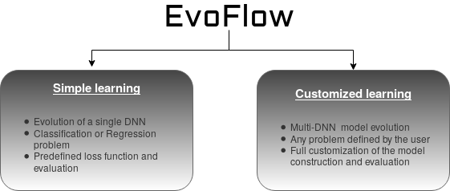

# EvoFlow

**EvoFlow offers the necessary facilities for the evolution of DNN structures with different needs, objectives, and complexities.**

## Main library dependencies

This Python tool has the basic dependencies of numpy and functools. However, the largest part of the library and core lay on <a href="https://www.tensorflow.org/">Tensorflow</a>  [[1]](#1) for the model creation and evaluation, and on <a href="https://github.com/deap/deap">DEAP</a>  [[2]](#2) for the evolutionary component. More specifically, EvoFlow supports Tensorflow 1.14 and DEAP 1.3.

<p align="left">
<a href="https://www.tensorflow.org/"></a>
<a href="https://github.com/deap/deap"></a>
</p>

<br><br><br><br><br><br><br><br><br><br><br>

## Evolution modes

As it has been said, EvoFlow is able to fit in scenarios with different requirements and user knowledge in the area. The following diagram shows the three evolution modes currently available in EvoFlow:

<p align="center">
  
</p>

### Simple learning

In this mode, the user simply needs to specify the problem being treated (by setting the loss and fitness functions). The rest of the parameters are common to the rest of learning modes. The following code performs this kind of learning. It can also be found in <a href="./simple.py">simple.py</a>:

```python
x_train, y_train, x_test, y_test = load_fashion()

OHEnc = OneHotEncoder(categories='auto')

y_train = OHEnc.fit_transform(np.reshape(y_train, (-1, 1))).toarray()

y_test = OHEnc.fit_transform(np.reshape(y_test, (-1, 1))).toarray()

ef = Evolving(loss="XEntropy", desc_list=[MLPDescriptor], x_trains=[x_train], y_trains=[y_train], 
  x_tests=[x_test], y_tests=[y_test], evaluation="Accuracy_error", n_inputs=[[28, 28]], n_outputs=[[10]], 
  batch_size=150, population=20, generations=20, iters=100, n_layers=10, max_layer_size=100, seed=0)
res = ef.evolve()
```

In this case, we are evolving a classifier for the widely known <a href="https://github.com/zalandoresearch/fashion-mnist">Fashion-MNIST dataset</a> [[3]](#3). Because of this, the input of the model is a single input of size [28 x 28], and the output has 10 neuros, one per class in the data. The rest of the parameters are self explanatory.

### Half Customized learning

If the user has a problem type different from classification or regression, EvoFlow allows the definition of simple loss and evaluation functions. However, the loss functions must be inside the Tensorflow environment; either choosing one of the available ones, or implementing it. An example of one such usage of EvoFlow can be found in <a href="./AutoEncoder.py">AutoEncoder.py</a>:

```python
def hand_made_tf_mse(target, prediction):
    return tf.reduce_mean(tf.squared_difference(target, prediction))


def hand_made_np_mse(target, prediction):
    return np.mean(np.square(target-prediction))
```

This example is an implementation of straightforward loss and fitness functions. However, it can be extrapolated to more complex functions.

### Fully customized learning

Several examples of different multi-DNN models are provided within EvoFlow. These require deeper knowledge about the models to be implemented, as well as about Tensorflow and EvoFlow itself. In this customization level, the user must, in addition to the loss and fitness function, define the model construction. This is done in the function where the loss is computed, and it must be consistent with the usage it has in the function in which the fitness is computed. An example of loss function (from <a href="./CNNClass.py">CNNClass.py</a>) follows:

```python
def train_cnn(nets, placeholders, sess, graph, train_inputs, train_outputs, batch_size, hypers):
    aux_ind = 0
    predictions = {}
    with graph.as_default():
        out = nets["n0"].building(placeholders["in"]["i0"], graph)  # We need to flatten the output of the CNN before feeding it to the MLP
        out = tf.layers.dense(tf.layers.flatten(out), 20)
        predictions["n0"] = out
        out = nets["n1"].building(predictions["n0"], graph)
        predictions["n1"] = out

        lf = tf.losses.softmax_cross_entropy(placeholders["out"]["o1"], predictions["n1"])

        opt = optimizers[hypers["optimizer"]](learning_rate=hypers["lrate"]).minimize(lf)
        sess.run(tf.global_variables_initializer())
        for i in range(10):
            # As the input of n1 is the output of n0, these two placeholders need no feeding
            _, loss = sess.run([opt, lf], feed_dict={placeholders["in"]["i0"]: batch(train_inputs["i0"], batch_size, aux_ind), placeholders["out"]["o1"]: batch(train_outputs["o0"], batch_size, aux_ind)})

            aux_ind = (aux_ind + batch_size) % train_inputs["i0"].shape[0]

    return predictions
```

This function encompasses the creation and training of the model, in this case, a CNN combined with an MLP in a sequential way. this function takes as input the following parameters:

- nets: Dictionary with the Networks ("n0", "n1", ..., "nm", in the same order as they have been requested in the *desc_list* parameter). These networks must be built over their corresponding input.
- placeholders: Dictionary with input ("in"->"i0", "i1", ..., im) placeholders ("out"->"o0", "o1", ..., "om") for each network. These may or may not be used.
- sess: tf session to be used when training
- graph: tf graph to be used when training. Every tf operation must be performed inside it.
- train_inputs: Data to be used for training
- train_outputs: Data to be used for training
- batch_size: Batch_size to be used when training. It is not mandatory to use it.
- hypers: Optional hyperparameters being evolved in case they were defined for evolution (in this case we also evolve optimizer selection and learning rate)

And returns a dictionary with the tf layer which makes the predictions.

In this function, we

1. Build the CNN over its input placeholder.
2. Flatten the final layer of the CNN (returned when building the network) so that it can be fed to the MLP.
3. Build the MLP over the flattened output of the CNN. Therefore, the output placeholder of the CNN and the input placeholder of the MLP are not used.
4. Define the loss function and optimizer.
5. Perform the training.
6. Return the predictions we are going to need for the fitness computation (the prediction for "n0" is not necessary though)

Then, for computing the fitness value of the individual, we implement the following function:

```python
def eval_cnn(preds, placeholders, sess, graph, inputs, outputs, _):
    with graph.as_default():
        res = sess.run(tf.nn.softmax(preds["n1"]), feed_dict={placeholders["i0"]: inputs["i0"]})
        sess.close()

        return accuracy_error(res, outputs["o0"]),
```

which takes the following parameters:

- preds: Dictionary created in the arranging and training function
- placeholders: (Only) Input placeholders: ("i0", "i1", ..., "im").
- sess: tf session to perform inference
- graph: tf graph in which inference is performed
- inputs: Data inputs for the model
- outputs: Data outputs for the metric
- \_: hyperparameters, because we are evolving the optimizer selection and learning rate, they are unused when testing

And returns the fitness of the model (as a tuple)
    
In this case, we simply use the prediction of the "n1" network (the MLP which has the CNN behind) and use a metric function to determine how well the model has performed.

More examples of this kind of learning can be found in the following examples:


1. <a href="./sequential.py">sequential.py</a> places two MLPs in sequential form for the same classification problem
3. <a href="./GAN.py">GAN.py</a> presents a more complicated way of MLP interaction, as the complexity of the GAN model creation and the loss function definition considerably increases.
4. <a href="./CNNAE.py">CNNAE.py</a> finally defines a convolutional autoencoder, where trasposed convolutional DNNs are applied.

## Publications

An early version of EvoFlow was used for *Evolved GANs for generating Pareto set approximations* [[4]](#4). If you were to find EvoFlow interesting and happen to use it for your own applications, please, consider citing that paper:

```bibtex
@inproceedings{garciarena2018evolved,
  title={Evolved GANs for generating Pareto set approximations},
  author={Garciarena, Unai and Santana, Roberto and Mendiburu, Alexander},
  booktitle={Proceedings of the Genetic and Evolutionary Computation Conference},
  pages={434--441},
  year={2018},
  organization={ACM}
}

```

## References
<a id="1">[1]</a> 
Abadi, M., Agarwal, A., Barham, P., Brevdo, E., Chen, Z., Citro, C., ... & Ghemawat, S. (2016). Tensorflow: Large-scale machine learning on heterogeneous distributed systems. arXiv preprint arXiv:1603.04467.

<a id="2">[2]</a> 
Fortin, F. A., Rainville, F. M. D., Gardner, M. A., Parizeau, M., & Gagné, C. (2012). DEAP: Evolutionary algorithms made easy. Journal of Machine Learning Research, 13(Jul), 2171-2175.

<a id="3">[3]</a> 
Xiao, H., Rasul, K., & Vollgraf, R. (2017). Fashion-mnist: a novel image dataset for benchmarking machine learning algorithms. arXiv preprint arXiv:1708.07747.

<a id="4">[4]</a> 
Garciarena, U., Santana, R., & Mendiburu, A. (2018, July). Evolved GANs for generating Pareto set approximations. In Proceedings of the Genetic and Evolutionary Computation Conference (pp. 434-441). ACM.
